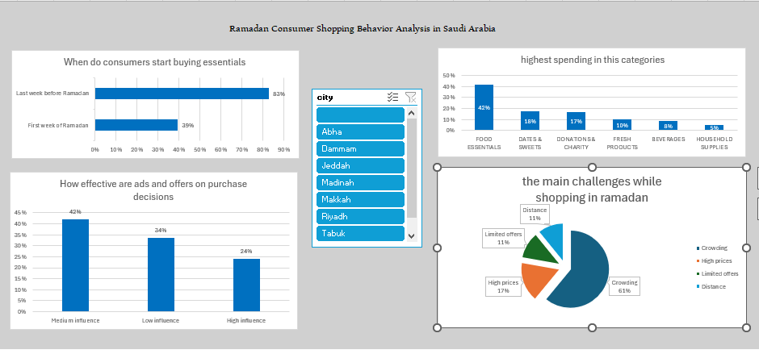

# Ramadan-Consumer-Behavior-Analysis
Exploratory data analysis of Saudi consumer shopping behavior during Ramadan using Excel
The goal is to understand spending patterns, shopping preferences, and challenges faced by consumers during the Ramadan season.

The project includes data cleaning, pivot table analysis, and dashboard.

## Tools Used

* Microsoft Excel
* Pivot Tables
* Pivot Charts

## Dataset Description

The dataset contains information about consumer behavior during Ramadan, including:

* Shopping preferences
* Ramadan spending categories
* Store preferences

## Data Cleaning Process

Before starting the analysis, several data cleaning steps were performed to ensure the dataset was accurate and ready for analysis.

### 1. Removing Duplicates

Duplicate records were removed using the Excel tool: Data → Remove Duplicates

This ensured that each row represents a unique consumer entry.

### 2. Handling Missing Values

Missing or incomplete data entries were reviewed and handled

### 3. Standardizing Text Values

Text categories were standardized to prevent duplicated categories during analysis.

Example:

* "Hyper Market" → "Hypermarket"

### 4. Data Type Correction

Columns were formatted to ensure correct data types:

* Numeric columns → Number
* Category columns → Text

This allows Pivot Tables to calculate metrics correctly.

### 5. Creating Calculated Columns

Additional calculated columns were created to support analysis

### 6. Preparing Data for Analysis

After cleaning the data, it was organized into structured tables to support:

* Pivot Tables
* Pivot Charts
* Dashboard Visualization

## Key Insights

Some key findings from the analysis include:

* Based on the analysis of Saudi consumer behavior, 68% of consumers start buying essentials in the week before Ramadan, compared to 32% in the first week of Ramadan
* Based on the analysis of Saudi consumer behavior, Food essentials represent the highest spending categories during Ramadan with 41.78%
* Most consumers report that advertisements have a medium influence on their purchasing decisions (42.1%), while high influence is less common (24.2%).
* Based on the analysis of Saudi consumer behavior, crowds are reported as the main challenge with 78.37% .while shopping during Ramadan, followed by high prices with 21.63%.

---

## Dashboard

An interactive dashboard was created using Pivot Tables and Pivot Charts to visualize:

* When do consumers start buying essentials?
* Which categories see the highest spend increase?
* How effective are ads and offers on purchase decisions?
* What are the main challenges while shopping in ramadan (Crowds vs Prices)?

The dashboard allows users to quickly explore insights from the dataset.

---

## Project Files

This repository contains:

* Excel dataset
* Cleaned data
* Pivot tables
* Final dashboard
* ## Dashboard Preview

